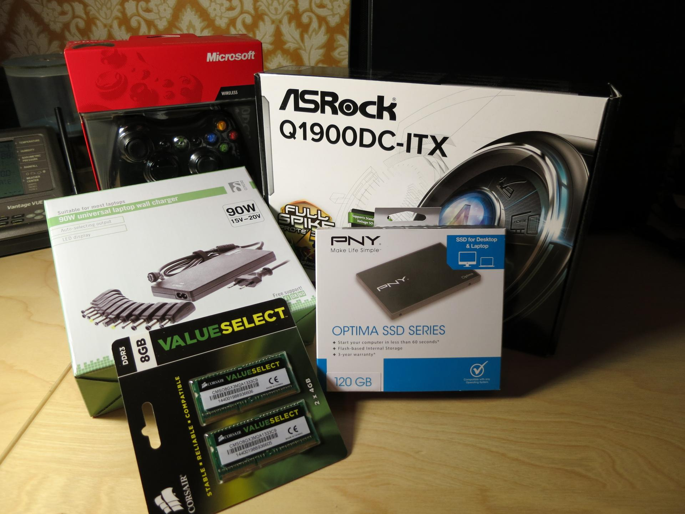
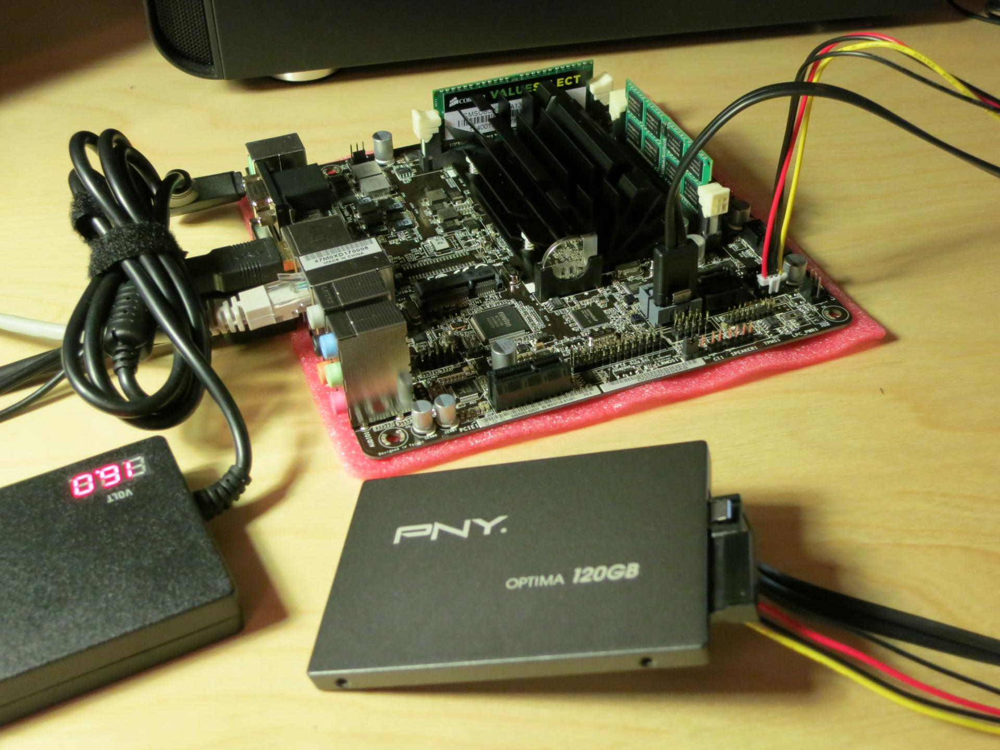
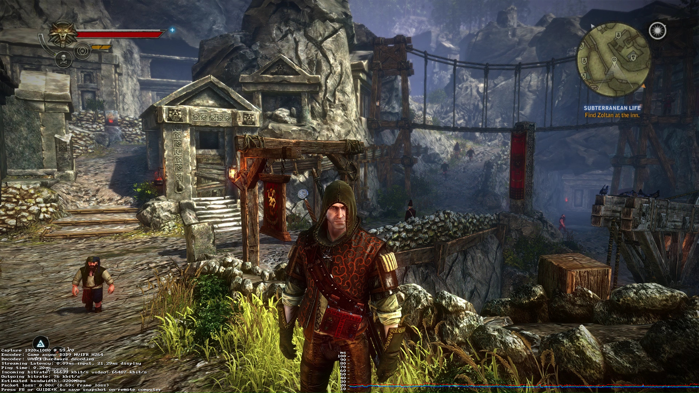

My HTPC was starting to feel a bit old
([Asus S1-AT5NM10E](http://www.asus.com/Barebone_PCs/S1AT5NM10E/) that I bought
in 2011) so I decided that it was time to get something new. I decided that I
might as well run [Steam OS](http://store.steampowered.com/steamos) on it so I
can play games from the comfort of my couch.

The fan noise from my HTPC has always annoyed me, it has two tiny fans that I
think are 40mm, they are RPM controlled but I still find them too loud. So the
next one would have to be passive since it's running 24/7 in my living room. I
looked around for Mini-ITX boards with integrated CPUs that were as new as
possible and the choice fell between the Pentium J2900 and Celeron J1900. Both
of these are actually Atom processors (Silvermont) despite their names.

I went for the [ASRock Q1900DC-ITX](http://www.asrock.com/mb/Intel/Q1900DC-ITX/)
since it had an integrated power supply so I didn't have to get a picoPSU or
something like that. The difference in clock speed versus the J2900 wasn't high
enough to justify the extra cost in my opinion.

## Hardware setup

I ordered the case from a different store than the rest of the things, and that
store is apparently closed until 16/2, so there's not really much to show about
the build, but I will post an update when I get the case.

* ASRock Q1900DC-ITX (2GHz quad-core)
* 8GB Corsair 1333MHz CL9
* 120GB PNY Optima SSD
* Deltaco universal laptop charger

Total cost for this was 2672 SEK (approx. $325 USD), obviously excluding the 360
controller and the case I don't have yet. You can save a bit by going down in
RAM size to 4GB, but Linux is good at utilizing RAM for cache so I chose 8GB.

There's not much to show here, just pop in the RAM and connect the cables.

## Software installation

Just follow the [official instructions for "Custom Installation"](http://store.steampowered.com/steamos/buildyourown) and everything should install automatically.

The first time it boots it will show you the desktop (yes, it looks broken, more
on this later) while it's updating the Steam client, just wait and when it's
done it will automatically reboot. After the reboot it started a clonezilla
backup, after it was finished I had to select reboot in the menu manually.

After that reboot is where the interesting part starts. I had major issues in
getting the graphics to work, when I booted everything just went black. I tried
changing the default display manager to gdm3 to be able to at least log in to
the desktop. This worked, sort of, but for some reason it didn't pick the
correct resolution and I couldn't see the entire workspace, I had colorful
flickering to the right and bottom of my screen. It also complained about
hardware acceleration so I was most likely stuck in software rendering mode.

This went on for a while with me testing out different possible solutions, like
manual Xorg.conf, different kernel parameters and so on. Then I checked the
kernel version, and saw that Steam OS is running 3.10, which to me (used to
Arch, running 3.18) felt like a really outdated version. So I decided to just
add the Debian unstable repo and get a new kernel from there, even though I
wasn't sure it'd help.

I won't list how to add a Debian repo here since the information is already
available all over the net, you can pretty much follow
[this guide](http://steamcommunity.com/groups/steamuniverse/discussions/1/648814396114274132/)
but replace wheezy with unstable where appropriate. Make sure that you set the
priorities in `/etc/apt/preferences` so that it only uses packages from the
unstable repo if you explicitly specify it. Since you won't be able to access
the desktop everything has to be done from the VTY, press Ctrl+Alt+F2 to get to
it. If it doesn't work for you you could try booting to recovery shell, hold Esc
after powering on and select the second entry from the top in the Grub menu that
appears, this should boot you straight in to a shell with root access.

After that you just run `sudo apt-get install -t unstable linux-image-amd64` and
the new kernel (3.16 right now) should be downloaded and installed. Reboot
either by Ctrl+Alt+Del or `sudo init 6`. Steam should now start in full screen
with proper hardware acceleration and everything.

One problem I noticed with the new kernel is that the kernel module for the
network adapter wouldn't load automatically, so you won't be able to get past
the network configuration part of the setup wizard. I don't know why this
happens but it's really easy to fix, switch to VTY using Ctrl+Alt+F2 and log in
using the desktop account, run `sudo modprobe r8169` and the NIC should be
instantly detected and working. This will however only work until you reboot, so
for a permanent fix you _also_ have to run `sudo sh -c 'echo r8169 >>
/etc/modules'` so that it's loaded on each boot. After you have done this you
just switch back to the Steam setup wizard with Ctrl+Alt+F7.

## Benchmarks

I like graphs and numbers, so I've decided to run a few benchmarks to see how
the performance of this system is, and what you can expect from it if you're
interesting in building a similar one yourself.

I decided to stream The Witcher 2 for about 15 minutes while measuring network,
CPU and RAM usage. I changed the bandwidth limit to unlimited even though it
says that it increases latency, I also set "Client options" to "Beautiful", but
I'm not even sure what that does.

I had major issues when I had SLI enabled, the Steam client crashed when I
started the game, and I was stuck on a black screen. So I disabled SLI for this
test, so no Ubersampling (SSAA) enabled. Everything else is on max, but motion
blur is disabled since I hate it with a passion.

By looking at the network graph (showing Mbit/s) we can see that there's a
pretty large amount of data being sent, but nothing the gigabit switch can't
handle. I noticed that it never went above 100 Mbit/s so I measured the
throughput with iperf just to be sure, and it did show 944 Mbit/s.

You can actually see in the graph that I was in a part where there were a lot of
cinematics, with less changes in the image than normal. The beginning and the
end is where I pretty much just run around all the time, making it peak at about
90 Mbit/s. The red spikes you see in the upload is caused by me pressing F8 to
save a screenshot and stats dump to the host.

The next image shows the CPU usage % of each core, I graphed this just in case one
of the cores were close to maxed out. Luckily this wasn't the case, and it seems
to be distributing things over all 4 cores. You can see where I save
screenshots/stats in this graph as well.

This last graph shows the CPU load average, the RAM usage in % and the
temperature of the hottest core in degrees Celsius. The temperature is really
good considering that I have no fan anywhere near the board, this might change
when I put it inside a case. RAM usage is so ridiculously low that I regret
logging it in % instead of MB, I think it's around 300-400 MB (excluding buffers
and cache).

I have uploaded the script that I wrote to generate these graphs to GitHub, for
those of you who might be interested, it's available
[here](https://gist.github.com/Kwarf/8dd248ccfdb04a0f6801). You can also
download my rrd database from [here](log.rrd), if you for some
reason would like to graph something else from it.

Stay tuned for the coming update where I'll be mounting everything in a case,
probably around February 18-20. If there's anything else you'd like me to test
just leave a comment and I'll try to make it happen.
