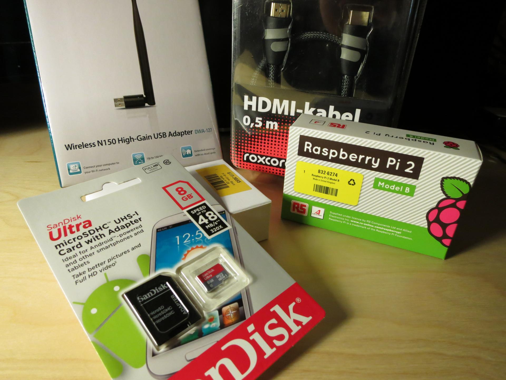
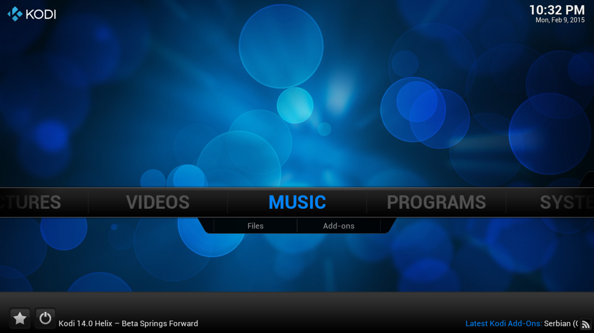
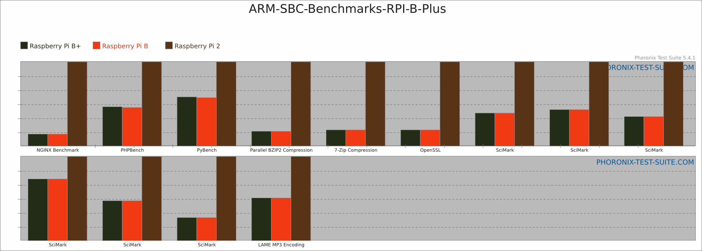

I usually watch TV shows on my laptop in bed before I fall asleep. Some nights I
manage to fall asleep before the end of the show, without turning off my laptop,
which means that it gets pretty hot due to the air intake being blocked. So with
the launch of the Raspberry Pi 2 I've decided to make a more permanent solution,
placing one of my old 24" monitors on my nightstand and run Kodi on the RPi.

As always the distro of choice is Arch Linux. This installation guide will
assume that you're running Linux, if you're on any other O/S you're on your own.
It will mostly be an overview, with references to information on other pages
since I think it's meaningless to repeat everything that's already available.

## Installation

Download [the image](http://os.archlinuxarm.org/os/ArchLinuxARM-rpi-2-latest.tar.gz),
I recommend that you [check the md5](http://os.archlinuxarm.org/os/ArchLinuxARM-rpi-2-latest.tar.gz.md5)
after your download has finished to make sure everything went okay.

To get it all installed properly on a card just follow the
[official instructions](http://archlinuxarm.org/platforms/armv7/broadcom/raspberry-pi-2)
under _Installation_.

The first thing I do after booting the RPi is change the hostname, timezone and
keymap. The regular [Arch installation guide](https://wiki.archlinux.org/index.php/Installation_guide#Configure_the_system)
will show you how to do this. After this you can run `pacman -Syu` to update the
system. If you're like me and don't need overscan (if the text in the console is
a bit in from the edge) you should disable it by uncommenting
`disable_overscan=1` in `/boot/config.txt` and on the last row of that file you
_need to_ change `gpu_mem=64` to `gpu_mem=256`. After doing this we should
reboot with `systemctl reboot`.

The next step is to install Kodi, specifically the Raspberry Pi version with
`pacman -S kodi-rbp`, when prompted about libgl provider just hit enter for the
default mesa-libgl. After everything is downloaded and installed you should
enable Kodi to start at boot with `systemctl enable kodi` and then start it with
`systemctl start kodi`. After a few seconds of loading Kodi should start.

## Benchmarks

I've made some very scientific measurements using a stopwatch and there's about
16 seconds from plugging in the power cord until the Kodi logo is showing.
Systemd-analyze says `Startup finished in 5.659s (kernel) + 3.964s (userspace) = 9.624s`
which is rather impressive in my opinion.

However the most interesting thing to test is how it handles video playback, so
I downloaded the 80 Mbit/s test file from [here](http://jell.yfish.us/). The
file is streamed from my NAS over Samba, using a wired connection. The RPi
struggles to buffer it fast enough, and since it only has a 100 Mbit/s NIC it's
understandable, I measured 94.1 Mbit/s with iperf so it's pretty close to the
limit. However from a CPU performance standpoint there's no problem at all, with
an average load at around 0.5 and an even load across the 4 cores.

I switched down to the 70 Mbit/s file but I still had some occasional
stuttering. When going down yet another step to 60 Mbit/s I get perfect playback
with no lag or stuttering at all, so time for some graphs!

I used a [modified version](https://gist.github.com/Kwarf/e2f7fcb0feb713fde5be)
of the script I made for my [last blog post](/2015/02/building-a-steam-machine-part-1/).
The sample movie is 60 seconds long and I logged data for 90 s to be able to see
idle load as well. The rrd file is [available here](pi.rrd).

I also found [this test](http://www.phoronix.com/scan.php?page=news_item&px=MTc0NjQ)
on Phoronix, so I installed phoronix-test-suite so I could run that same
benchmark and compare my results to the old single-core RPi.

You can see the full benchmark results over at
[http://openbenchmarking.org/result/1502103-KWAR-140722031](http://openbenchmarking.org/result/1502103-KWAR-140722031).

## Conclusion

The new Raspberry Pi 2 is a much better option for a cheap HTPC than the old
one. It doesn't have that horrible lag in the Kodi menus and it handles movies
without issues. It could also make a great energy efficient web server for
static pages as the Nginx benchmarks show.

The weakest link seems to be I/O, the network card is internally connected to
the USB bus, so it shares bandwidth with the four USB ports, something to
consider if you plan on attaching storage devices and accessing them over the
network.
