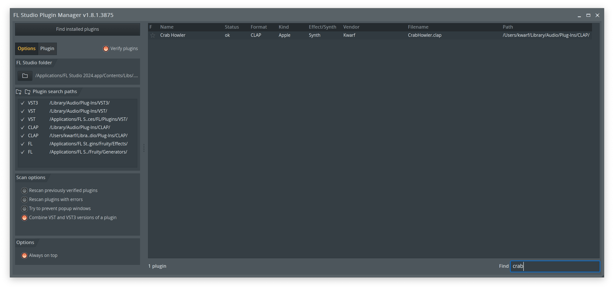

I've started to become a bit interested in playing around with sound synthesis
as of late, and with the release of [FL Studio
2024](https://www.image-line.com/fl-studio-news/fl-studio-2024-whats-new/)
adding CLAP plugin support I though that now would be perfect.

[CLAP](https://cleveraudio.org) is basically an open source (MIT-licensed)
alternative to VST, which means there's no need to worry about any Steinberg
licenses.

Before anything else I'd like to emphasize that I have **no** prior experience
writing DAW plugins, synthesizers or effects, so this will very much be a
_learn-with-me-as-we-go-along_ series of blog posts. With that out of the way
let's get started.

## Creating the project

Let's start by creating a new library project, change the name of course if
you're following along.

```sh
cargo new --lib crabhowler
```

We want to produce a `cdylib` so we add the following section to our
`Cargo.toml` file.

```toml
[lib]
crate-type = ["cdylib"]
```

For the CLAP API I took a quick look around and decided to use
[github.com/prokopyl/clack](https://github.com/prokopyl/clack) which claims to
be a "safe, low-level wrapper to create CLAP audio plugins and hosts in Rust",
and that sounds great, meaning we don't have to use
[clap-sys](https://crates.io/crates/clap-sys) directly.

However from what I could see it does not appear to be uploaded to crates.io
(yet?) so we will have to add it as a git dependency.

```sh
cargo add --git https://github.com/prokopyl/clack.git clack-plugin
```

## Getting it to show up in a DAW

A step that I feel would be logical to get out of the way as quickly as possible
is to get our plugin to show up in the list inside a DAW.

This essentially means that we need to define our plugin struct and implement
all traits required to allow us to `clack_export_entry!`.

I ended up with this (I will link to my repository at
[the end of the post](#getting-the-code) so it's okay if you skip intermediary
code steps if you're only after the end result).

```rs
use clack_plugin::{
    clack_export_entry,
    entry::{DefaultPluginFactory, SinglePluginEntry},
    host::{HostAudioProcessorHandle, HostMainThreadHandle, HostSharedHandle},
    plugin::{
        Plugin, PluginAudioProcessor, PluginDescriptor, PluginError, PluginMainThread, PluginShared,
    },
    prelude::PluginExtensions,
    process::{Audio, Events, PluginAudioConfiguration, Process, ProcessStatus},
};

pub struct CrabHowler;

impl Plugin for CrabHowler {
    type AudioProcessor<'a> = CrabHowlerAudioProcessor<'a>;
    type Shared<'a> = CrabHowlerShared;
    type MainThread<'a> = CrabHowlerMainThread<'a>;

    fn declare_extensions(builder: &mut PluginExtensions<Self>, shared: Option<&Self::Shared<'_>>) {
    }
}

impl DefaultPluginFactory for CrabHowler {
    fn get_descriptor() -> PluginDescriptor {
        use clack_plugin::plugin::features::*;

        PluginDescriptor::new("com.kwarf.crabhowler", "Crab Howler")
            .with_vendor("Kwarf")
            .with_features([INSTRUMENT, SYNTHESIZER, STEREO])
    }

    fn new_shared(host: HostSharedHandle) -> Result<Self::Shared<'_>, PluginError> {
        Ok(CrabHowlerShared {})
    }

    fn new_main_thread<'a>(
        host: HostMainThreadHandle<'a>,
        shared: &'a Self::Shared<'a>,
    ) -> Result<Self::MainThread<'a>, PluginError> {
        Ok(Self::MainThread { shared })
    }
}

pub struct CrabHowlerAudioProcessor<'a> {
    shared: &'a CrabHowlerShared,
}

impl<'a> PluginAudioProcessor<'a, CrabHowlerShared, CrabHowlerMainThread<'a>>
    for CrabHowlerAudioProcessor<'a>
{
    fn activate(
        host: HostAudioProcessorHandle<'a>,
        main_thread: &mut CrabHowlerMainThread<'a>,
        shared: &'a CrabHowlerShared,
        audio_config: PluginAudioConfiguration,
    ) -> Result<Self, PluginError> {
        todo!()
    }

    fn process(
        &mut self,
        process: Process,
        audio: Audio,
        events: Events,
    ) -> Result<ProcessStatus, PluginError> {
        todo!()
    }
}

pub struct CrabHowlerShared {}

impl<'a> PluginShared<'a> for CrabHowlerShared {}

pub struct CrabHowlerMainThread<'a> {
    shared: &'a CrabHowlerShared,
}

impl<'a> PluginMainThread<'a, CrabHowlerShared> for CrabHowlerMainThread<'a> {}

clack_export_entry!(SinglePluginEntry<CrabHowler>);
```

Then let's make a release build of it just for good measure.

```sh
cargo build --release
```

### Stop for some macOS nonsense

_Ignore this entire section if you're sane enough to run some other OS._

It doesn't seem like macOS (or at least FL Studio on mac) likes loading CLAP
plugins directly in the `.dylib` format, so we will have to create a bundle.

I looked at [cargo-bundle](https://crates.io/crates/cargo-bundle) which seems to
be the go-to thing to use, however it doesn't seem like it supports bundling
projects that are just a library. So I guess I'll have to do it manually.

I want the absolute simplest `Info.plist` file possible, which looks to be
something like this.

```xml
<?xml version="1.0" encoding="UTF-8"?>
<!DOCTYPE plist PUBLIC "-//Apple//DTD PLIST 1.0//EN" "http://www.apple.com/DTDs/PropertyList-1.0.dtd">
<plist version="1.0">
<dict>
    <key>CFBundleName</key>
    <string>Crab Howler</string>
    <key>CFBundleExecutable</key>
    <string>libcrabhowler.dylib</string>
    <key>CFBundleIdentifier</key>
    <string>com.kwarf.crabhowler</string>
</dict>
</plist>
```

Throw that shit in a directory structure that looks like this, where
`libcrabhowler.dylib` is the binary from the `target/release/` folder.

```txt
CrabHowler.clap
└── Contents
    ├── Info.plist
    └── MacOS
        └── libcrabhowler.dylib
```

This folder can now be placed in `~/Library/Audio/Plug-Ins/CLAP`.

### Back to more OS agnostic things

You might have to add a new search path inside your DAW of choice for it to pick
up the new plugin, but that's the same as for any other plug.

After a quick rescan inside FL Studio it shows up! Nice!



## Making some noise

What good is an instrument plugin if it can't make any sound at all? Let's
change that now.

We need to advertise that we support the note ports extension and audio ports
extensions, which clack calls plugins, and they are in a separate crate which we
have to add as a first step.

```sh
cargo add --git https://github.com/prokopyl/clack.git clack-extensions --features clack-plugin,audio-ports,note-ports
```

After this we can add them to the `declare_extensions` method in our `Plugin`
impl.

```rs
fn declare_extensions(
    builder: &mut clack_plugin::prelude::PluginExtensions<Self>,
    shared: Option<&Self::Shared<'_>>,
) {
    builder
        .register::<PluginAudioPorts>()
        .register::<PluginNotePorts>();
}
```

We then need to add implementations of these plugin traits for our main thread
for everything to compile again.

For the audio port we want to advertise a single output port, with 2 channels
(stereo) and indicate that it's the main port.

```rs
impl<'a> PluginAudioPortsImpl for CrabHowlerMainThread<'a> {
    fn count(&mut self, is_input: bool) -> u32 {
        if !is_input {
            1
        } else {
            0
        }
    }

    fn get(&mut self, index: u32, is_input: bool, writer: &mut AudioPortInfoWriter) {
        if !is_input && index == 0 {
            writer.set(&AudioPortInfo {
                id: ClapId::new(1),
                name: b"main",
                channel_count: 2,
                flags: AudioPortFlags::IS_MAIN,
                port_type: Some(AudioPortType::STEREO),
                in_place_pair: None,
            });
        }
    }
}
```

Then we want the reverse for the note port, a single input.

```rs
impl<'a> PluginNotePortsImpl for CrabHowlerMainThread<'a> {
    fn count(&mut self, is_input: bool) -> u32 {
        if is_input {
            1
        } else {
            0
        }
    }

    fn get(&mut self, index: u32, is_input: bool, writer: &mut NotePortInfoWriter) {
        if is_input && index == 0 {
            writer.set(&NotePortInfo {
                id: ClapId::new(1),
                name: b"main",
                preferred_dialect: Some(NoteDialect::Clap),
                supported_dialects: NoteDialects::CLAP,
            })
        }
    }
}
```

### Setting up an oscillator

Let's take a break from all things clack here and write a dead simple oscillator
that we can use to generate samples. We'll separate it out and try to write it
somewhat generically so that we could swap it out in the future for different
waveforms and things like that.

We'll set up a simple trait, we need to know about `NoteOnEvent` and
`NoteOffEvent` and then we need a function that will fill the output buffer with
data. Let's also include a way to check if the oscillator is active or not so
that we can report back to the DAW if our plugin can sleep until it's sent new
events. Put all this in a new file called `oscillator.rs` to keep things clean.

```rs
pub trait Oscillator {
    fn handle_note_on(&mut self, event: &NoteOnEvent);
    fn handle_note_off(&mut self, event: &NoteOffEvent);
    fn process(&mut self, left: &mut [f32], right: &mut [f32]);
    fn is_active(&self) -> bool;
}
```

I'm going to create a monophonic sine wave oscillator, but of course you're free
to make any other waveform if you'd like. We have to keep track of the sample
rate, frequency, and phase.

```rs
pub struct SineOscillator {
    sample_rate: f32,
    frequency: f32,
    phase: f32,
}

impl SineOscillator {
    pub fn new(sample_rate: f32) -> Self {
        Self {
            sample_rate,
            frequency: 0.0,
            phase: 0.0,
        }
    }
}

impl Oscillator for SineOscillator {
    fn handle_note_on(&mut self, event: &NoteOnEvent) {
        if let Match::Specific(key) = event.key() {
            self.frequency = 440.0 * 2.0f32.powf((key as f32 - 57.0) / 12.0);
        }
    }

    fn handle_note_off(&mut self, _event: &NoteOffEvent) {
        self.frequency = 0.0;
        self.phase = 0.0;
    }

    fn process(&mut self, left: &mut [f32], right: &mut [f32]) {
        if self.frequency == 0.0 {
            left.fill(0.0);
            right.fill(0.0);
            return;
        }

        let increment = std::f32::consts::TAU * self.frequency / self.sample_rate;
        for (left, right) in left.iter_mut().zip(right.iter_mut()) {
            let sample = (self.phase * increment).sin();
            *left = sample;
            *right = sample;
            self.phase = (self.phase + 1.0) % self.sample_rate;
        }
    }

    fn is_active(&self) -> bool {
        self.frequency != 0.0
    }
}
```

### Initializing the oscillator

All sound generation is done inside our `PluginAudioProcessor` implementation,
so we will have to add our new oscillator to that.

```rs
pub struct CrabHowlerAudioProcessor<'a> {
    osc: Box<dyn Oscillator + Send>,
    shared: &'a CrabHowlerShared,
}
```

An then we initialize it in the `activate` function.

```rs
fn activate(
    host: HostAudioProcessorHandle<'a>,
    main_thread: &mut CrabHowlerMainThread<'a>,
    shared: &'a CrabHowlerShared,
    audio_config: PluginAudioConfiguration,
) -> Result<Self, PluginError> {
    Ok(Self {
        osc: Box::new(SineOscillator::new(audio_config.sample_rate as f32)),
        shared,
    })
}
```

And yes, there's no real reason to `Box` it right now, but I might want to be
able to support different implementations in the future, and I don't think we
should worry about any performance lost by the indirection while learning.

### Wiring up events and output

Now all that's left is for us to handle the note event sent to us from the DAW,
pass those along to our oscillator, and then call `process` with the audio
buffers we are given to generate sound!

Because I wanted mutable references to _both_ the left and right channel
simultaneously in order to simplify handling stereo signals in the future this
ended up a bit messier than I would have liked. Let me know if I'm being stupid
and have missed some better way to do this.

```rs
fn process(
    &mut self,
    process: Process,
    mut audio: Audio,
    events: Events,
) -> Result<ProcessStatus, PluginError> {
    let mut output_port = audio
        .output_port(0)
        .ok_or(PluginError::Message("No output port"))?;

    let mut output_channels = output_port
        .channels()?
        .into_f32()
        .ok_or(PluginError::Message("Output is not f32"))?;

    // A bit of acrobatics to get simultaneous mutable references to both the left and right channels
    let mut split = output_channels.split_at_mut(1);
    let (left, right) = (
        split
            .0
            .channel_mut(0)
            .ok_or(PluginError::Message("Left channel not found"))?,
        split
            .1
            .channel_mut(0)
            .ok_or(PluginError::Message("Right channel not found"))?,
    );

    for batch in events.input.batch() {
        for event in batch.events() {
            match event.as_core_event() {
                Some(CoreEventSpace::NoteOn(event)) => self.osc.handle_note_on(event),
                Some(CoreEventSpace::NoteOff(event)) => self.osc.handle_note_off(event),
                _ => {}
            }
        }

        let (left, right) = (
            &mut left[batch.sample_bounds()],
            &mut right[batch.sample_bounds()],
        );

        self.osc.process(left, right);
    }

    if self.osc.is_active() {
        Ok(ProcessStatus::Continue)
    } else {
        Ok(ProcessStatus::Sleep)
    }
}
```

Now let's make a new release build and load it up in the DAW like we did
earlier. Plop out some notes to make a simple tune (keep in mind that it should
be monophonic) and hit play, and voila!



You can probably hear that we have clicks whenever a note ends, this is because
we stop the waveform immediately, regardless of where we are. Ideally we should
stop exactly at the zero-crossing point, but I wanted to keep the code as simple
as possible for now.

### Getting the code

Everything we've made up until this point can be accessed by browsing the
`part-1` tag over at [github.com/Kwarf/crabhowler](https://github.com/Kwarf/crabhowler/tree/part-1).

## What's next?

This feels like a good stopping point for part 1 of the series. The next part
will probably introduce a GUI with at least one tuneable parameter.

To get some sort of notification when that's posted you can follow me on
Mastodon at [@kwarf@fosstodon.org](https://fosstodon.org/@kwarf) or subscribe to
the [RSS Feed](/blog/index.xml) if you're old-school cool like that.
