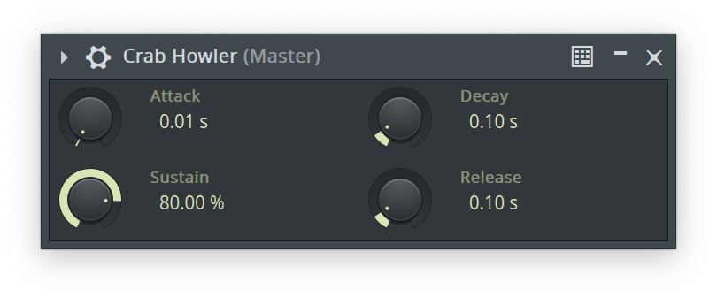

In the [previous post](/2024/07/writing-a-clap-synthesizer-in-rust-part-1/) we
got far enough to have created a CLAP plugin that can be loaded in a DAW and
play basic monophonic sine wave tones from the note data. At the end of that
post I mentioned that the next step would likely be to make a GUI, but I have
_changed my mind_.

I got annoyed enough by the constant clicks that occur at the end of each note
(as you can hear in the video at the end of the previous post) due to the
simplicity of our oscillator and figured that I wanted to add a proper decay on
note-off. Since I'm currently a feeling a bit overconfident I figured we might
as well take it all the way and implement a "proper"
[ADSR](<https://en.wikipedia.org/wiki/Envelope_(music)#ADSR>) envelope
generator.

## Getting started

The current starting point of all the code can be browsed on the
[GitHub repository](https://github.com/Kwarf/crabhowler/tree/part-1), and I will
add another link at the end of the post to a tag that shows the state we ended
up at after doing everything.

In order for us to advertise parameters over the CLAP API we need to enable more
feature flags of the `clack-extensions` dependency, specifically `params`, but
we will also want to persist the value of these parameters so that adjustments
made by the user are saved and restored properly, and this is done with `state`.

```sh
cargo add --features params,state clack-extensions
```

Let's start by creating a new file called `envelope.rs` so we don't end up with
too much of a mess. To start with we will just create a struct for the envelope
parameters and an implementation of the `Default` trait, since that will
simplify things in a bit. The default values here are just guesses, and will
likely be changed when we actually get sound produced by them.

```rs
pub struct Envelope {
    pub attack: f32,
    pub decay: f32,
    pub sustain: f32,
    pub release: f32,
}

impl Default for Envelope {
    fn default() -> Self {
        Self {
            attack: 0.01,
            decay: 0.1,
            sustain: 0.8,
            release: 0.1,
        }
    }
}
```

Then we can move back to our `lib.rs` to declare that we now support parameters
in our `Plugin` impl by registering `PluginParams`.

```rs
fn declare_extensions(builder: &mut PluginExtensions<Self>, shared: Option<&Self::Shared<'_>>) {
    builder
        .register::<PluginAudioPorts>()
        .register::<PluginNotePorts>()
        .register::<PluginParams>();
}
```

This immediately causes compilation errors to show up, because we are now
expected to provide an implementation of `PluginMainThreadParams` for our main
thread. This is a fairly small trait with only 6 functions, but I will still
split it up and explain each part step by step.

## Main thread implementation

The first function is `count`, and this is as simple as it gets to implement
because we have already decided to have attack, decay, sustain and release as
our parameters, so keep it simple and just return 4 here.

```rs
fn count(&mut self) -> u32 {
    4
}
```

Next up is `get_info`, this is called by the host (DAW) to get information such
as parameter name, min/max/default values and things like that. To keep things
simple we will keep all our parameters in the range of 0.0..1.0 so the only
thing that will differ is the name and default values. This is where we find the
`Default` trait we implemented useful, so we can keep a single source of truth
and not risk forgetting to change values in multiple places in the future.

```rs
fn get_info(&mut self, param_index: u32, info: &mut ParamInfoWriter) {
    if let Some((name, default)) = match param_index {
        0 => Some(("Attack", Envelope::default().attack)),
        1 => Some(("Decay", Envelope::default().decay)),
        2 => Some(("Sustain", Envelope::default().sustain)),
        3 => Some(("Release", Envelope::default().release)),
        _ => None,
    } {
        info.set(&ParamInfo {
            id: param_index.into(),
            flags: ParamInfoFlags::IS_AUTOMATABLE,
            cookie: Default::default(),
            name: name.as_bytes(),
            module: b"",
            min_value: 0.0,
            max_value: 1.0,
            default_value: default as f64,
        });
    }
}
```

Now we're at `get_value` which means that we have to take a look at how and
where state is actually held. From a quick glance at the code we can see that
the type that is accessible both to the audio processor and the main thread is
the type that we declared in our `Plugin` implementation as
`type Shared<'a> = CrabHowlerShared;`, which has been empty up until now, so
let's change that.

```rs
#[derive(Default)]
pub struct CrabHowlerShared {
    envelope: RwLock<Envelope>,
}
```

Note that we wrap it inside of an `RwLock`, this is because we need to be able
to perform mutable writes to it from different threads that are only given
immutable `&`-references to the shared state. It will all make sense further
down, hopefully.

Because of our earlier implementation of `Default` for the `Envelope` type we
can just derive that trait here, which allows a very simple change in the plugin
factory to result in the state being created with correct defaults.

```rs
impl DefaultPluginFactory for CrabHowler {
    ...
    fn new_shared(_host: HostSharedHandle) -> Result<Self::Shared<'_>, PluginError> {
        Ok(CrabHowlerShared::default())
    }
    ...
```

After all this we end up with a pretty clean and straight-forward implementation
for `get_value`.

```rs
fn get_value(&mut self, param_id: ClapId) -> Option<f64> {
    let envelope = self.shared.envelope.read().ok()?;
    match param_id.into() {
        0 => Some(envelope.attack as f64),
        1 => Some(envelope.decay as f64),
        2 => Some(envelope.sustain as f64),
        3 => Some(envelope.release as f64),
        _ => None,
    }
}
```

The next _two_ functions to implement are `value_to_text` and `text_to_value`,
the first being what the host (DAW) will use to format the value into something
more user-friendly like "100 ms" before displaying it to the user, and the
latter being used to convert user input back into a parameter value.

At this point we have a decision to make, if we want to present some abstract
unit to the user like a range from 0% -> 100%, or if we want actual proper time
units. I think time units looks better, but to simplify everything we'll make it
so that the value is in seconds, ideally we would probably want some sort of
exponential curve to make it easy to set small values, but I think we can get
away with keeping it simple by only allowing a 1 second maximum.

Keeping all this in mind we end up with something like this. Note that we have
an edge case that is parameter 2 (the sustain), since that controls gain and not
time. There's also some logic to disregard any suffix that we might get in the
user provided string, so that "0.5 s" will actually parse into 0.5.

```rs
fn value_to_text(
    &mut self,
    param_id: ClapId,
    value: f64,
    writer: &mut ParamDisplayWriter,
) -> std::fmt::Result {
    use std::fmt::Write;
    match param_id.into() {
        0 | 1 | 3 => write!(writer, "{:.2} s", value),
        2 => write!(writer, "{:.2} %", value * 100f64),
        _ => Err(std::fmt::Error),
    }
}

fn text_to_value(&mut self, param_id: ClapId, text: &CStr) -> Option<f64> {
    let scale = if param_id == 2 { 0.01 } else { 1.0 };
    let input = text.to_str().ok()?;
    let suffix_idx = input
        .find(|c: char| !c.is_numeric() && c != '.' && c != ',')
        .unwrap_or_else(|| input.len());
    input[..suffix_idx].parse().map(|v: f64| v * scale).ok()
}
```

We've finally reached the last function in this trait, `flush`, which is what
the host (DAW) will call with a set of parameter changes that we should perform.

This is where we have to get that mutable access to the envelope that I talked
about earlier, and where the `RwLock` really comes into play.

```rs
fn flush(
    &mut self,
    input_parameter_changes: &clack_plugin::prelude::InputEvents,
    _output_parameter_changes: &mut clack_plugin::prelude::OutputEvents,
) {
    for event in input_parameter_changes {
        if let Some(CoreEventSpace::ParamValue(event)) = event.as_core_event() {
            self.shared
                .envelope
                .write()
                .expect("Failed to acquire parameter write lock")
                .handle_event(event);
        }
    }
}
```

For reasons that will become apparent _just a few lines further down_ I added a
function to the `Envelope` to take the event and actually set the values.

```rs
impl Envelope {
    pub fn handle_event(&mut self, event: &ParamValueEvent) {
        match event.param_id().map(|x| x.into()) {
            Some(0) => self.attack = event.value() as f32,
            Some(1) => self.decay = event.value() as f32,
            Some(2) => self.sustain = event.value() as f32,
            Some(3) => self.release = event.value() as f32,
            _ => {}
        }
    }
}
```

We have now completed our implementation of the `PluginMainThreadParams` trait,
but you might have noticed that our code is still not compiling. This is because
we are _also_ expected to provide an implementation of
`PluginAudioProcessorParams` which is the equivalent trait for the audio
processor thread.

## Audio processor thread implementation

Thankfully this trait is very straightforward, with only a `flush` function, and
because we wrote that `handle_event` function we reduce duplication _at least a
tiny bit_, and the entire implementation ends up like this.

```rs
impl<'a> PluginAudioProcessorParams for CrabHowlerAudioProcessor<'a> {
    fn flush(
        &mut self,
        input_parameter_changes: &InputEvents,
        _output_parameter_changes: &mut OutputEvents,
    ) {
        for event in input_parameter_changes {
            if let Some(CoreEventSpace::ParamValue(event)) = event.as_core_event() {
                self.shared
                    .envelope
                    .write()
                    .expect("Failed to acquire parameter write lock")
                    .handle_event(event);
            }
        }
    }
}
```

There's also a small _gotcha_ that I encountered, that `ParamValue` events can
be sent to us in the `process` call of the audio processor as well, so we have
to make a similar change there, that function is rather big so I'll just include
the relevant bit. Note on/off were the only events we needed to handle here
before.

```rs
...
    match event.as_core_event() {
        Some(CoreEventSpace::NoteOn(event)) => self.osc.handle_note_on(event),
        Some(CoreEventSpace::NoteOff(event)) => self.osc.handle_note_off(event),
        Some(CoreEventSpace::ParamValue(event)) => self
            .shared
            .envelope
            .write()
            .expect("Failed to acquire parameter write lock")
            .handle_event(event),
        _ => {}
    }
...
```

## Persisting the parameter values

The plugin user will surely expect that any adjustments made to the parameters
are actually saved with the project, and loaded again when opened, so we should
implement state support.

Add a line to declare that we support `PluginState` so that we get new
compilation errors to work towards.

```rs
fn declare_extensions(builder: &mut PluginExtensions<Self>, shared: Option<&Self::Shared<'_>>) {
    builder
        .register::<PluginAudioPorts>()
        .register::<PluginNotePorts>()
        .register::<PluginParams>()
        .register::<PluginState>();
}
```

This shows us that we're expected to implement `PluginStateImpl` for our main
thread. This post is already way too long, so let's just create a really simple
implementation that directly saves/loads our 4 values directly. If you want
something a bit more sofisticated I'm sure
[bincode](https://crates.io/crates/bincode) could result in a cleaner solution
handling the entire struct as one.

```rs
impl<'a> PluginStateImpl for CrabHowlerMainThread<'a> {
    fn save(&mut self, output: &mut OutputStream) -> Result<(), PluginError> {
        let envelope = self.shared.envelope.read().or(Err(PluginError::Message(
            "Failed to acquire parameter read lock",
        )))?;
        output.write_all(&envelope.attack.to_le_bytes())?;
        output.write_all(&envelope.decay.to_le_bytes())?;
        output.write_all(&envelope.sustain.to_le_bytes())?;
        output.write_all(&envelope.release.to_le_bytes())?;
        Ok(())
    }

    fn load(&mut self, input: &mut InputStream) -> Result<(), PluginError> {
        let mut envelope = self.shared.envelope.write().or(Err(PluginError::Message(
            "Failed to acquire parameter write lock",
        )))?;
        let mut buf = [0; 4];
        input.read_exact(&mut buf)?;
        envelope.attack = f32::from_le_bytes(buf);
        input.read_exact(&mut buf)?;
        envelope.decay = f32::from_le_bytes(buf);
        input.read_exact(&mut buf)?;
        envelope.sustain = f32::from_le_bytes(buf);
        input.read_exact(&mut buf)?;
        envelope.release = f32::from_le_bytes(buf);
        Ok(())
    }
}
```

This is a good spot to take a break from writing code and making a new release
build to try out in the DAW. This will look differently depending on what DAW
you're using, because we're not drawing the UI ourselves (yet), instead relying
on the DAW to create knobs for the parameters we're advertising.

Adjusting things should work correctly, and when you save and re-open the
project everything should load up in the same state as when it was saved. Nice!



## Refactoring the oscillator

We're _finally_ at the point where we can go ahead and make use of our new
parameters to actually make the synthesizer sound better. Because I've spent
quite a few hours writing this post by now, and fear that I'm going slightly
mad, I've decided that we should make it polyphonic as well, _because why not_.
But first, the ADSR...

We will need some way to keep track of how far along the envelope we are, so we
can determine what stage we are in and what volume is expected of it at that
point in time. I think it's best to put this in a new file as well, let's call
it `adsr.rs`.

Only 3 of the 4 stages require us to track time, the sustain stage should be
active until we receive a note-off event. Let's make use of Rusts enum to track
our state like this.

```rs
#[derive(PartialEq)]
pub enum ADSRState {
    Attack(f32),
    Decay(f32),
    Sustain,
    Release(f32),
    Ended,
}
```

I'm thinking that we count samples as we go along, and to simplify and reduce
the number of casts we'll store them as `f32`.

In addition to keeping track of where we are we will of course have to know _for
how long_ we should be in each stage, thankfully we alredy have `Envelope` from
before for this, so we'll go ahead and combine the two into a new struct.

```rs
pub struct ADSR {
    envelope: Envelope,
    pub state: ADSRState,
}
```

This gives us everything we need to move along the envelope and calculate gain
values as we go along. This will be done for each sample, so I figure that it's
easiest to make a `process` function that _both_ increments the current state as
well as returning the current value while doing so.

```rs
impl ADSR {
    pub fn new(envelope: Envelope) -> Self {
        ADSR {
            envelope,
            state: ADSRState::Attack(0.0),
        }
    }

    pub fn release(&mut self) {
        self.state = ADSRState::Release(0.0);
    }

    pub fn process(&mut self, sample_rate: f32) -> f32 {
        match self.state {
            ADSRState::Attack(sample) => {
                let attack_samples = self.envelope.attack * sample_rate;
                self.state = if sample >= attack_samples {
                    ADSRState::Decay(0.0)
                } else {
                    ADSRState::Attack(sample + 1.0)
                };
                sample / attack_samples
            }
            ADSRState::Decay(sample) => {
                let decay_samples = self.envelope.decay * sample_rate;
                self.state = if sample >= decay_samples {
                    ADSRState::Sustain
                } else {
                    ADSRState::Decay(sample + 1.0)
                };
                1.0 - (1.0 - self.envelope.sustain) * (sample / decay_samples)
            }
            ADSRState::Sustain => self.envelope.sustain,
            ADSRState::Release(sample) => {
                let release_samples = self.envelope.release * sample_rate;
                self.state = ADSRState::Release(sample + 1.0);
                self.state = if sample >= release_samples {
                    ADSRState::Ended
                } else {
                    ADSRState::Release(sample + 1.0)
                };
                self.envelope.sustain * (1.0 - sample / release_samples)
            }
            ADSRState::Ended => 0.0,
        }
    }
}
```

I won't go into too much detail here as it's not very complicated, it's
basically just a state machine with some linear interpolations.

### Managing the voices

We have quite some changes ahead of us back in our old `oscillator.rs`. First of
all we have to move `frequency` and `phase` out from the `SineOscillator` into a
new `Voice` struct, to actually keep track of the different tones we're
generating.

We will also need some additional information so we can figure out in the
note-off events which of the active voices we should start the release of. Then
the new `ADSR` state struct we just created of course, and let's throw in note
velocity as well since it will just be another multiplicaiton.

Let's also prepare for the future by lifting over the wave generation from
`process` into a function on the `Voice`.

```rs
pub struct Voice {
    channel: u16,
    key: u16,
    note_id: Option<u32>,
    frequency: f32,
    phase: f32,
    velocity: f32,
    adsr: ADSR,
}

impl Voice {
    pub fn next_sample(&mut self, sample_rate: f32) -> f32 {
        let increment = self.frequency / sample_rate;
        let sample = (self.phase * std::f32::consts::TAU).sin();
        self.phase = (self.phase + increment) % 1.0;
        sample
    }
}
```

The only thing left in our initial struct is `sample_rate`, and of course our
new voice bank. I decided on 16 simply because 8 would be less than you have
fingers (probably), and I like round numbers. `Option` is just because I think
it's pretty clean to just set it to `None` when it's not playing.

```rs
pub struct SineOscillator {
    sample_rate: f32,
    voices: [Option<Voice>; 16],
}
```

In `handle_note_on` we will now have to first find a free "slot" in our array,
then initialize a voice there with all our note and parameter data. One thing to
keep in mind here is that I `clone()` the parameters, meaning that any
changes or automations done after the note is triggered will not be applied, but
I don't think that's a problem for what we're building here.

```rs
fn handle_note_on(&mut self, envelope: &super::Envelope, event: &NoteOnEvent) {
    if let (Match::Specific(channel), Match::Specific(key)) = (event.channel(), event.key()) {
        if let Some(voice) = self.voices.iter_mut().find(|voice| voice.is_none()) {
            *voice = Some(Voice {
                channel,
                key,
                note_id: event.note_id().into_specific(),
                frequency: 440.0 * 2.0f32.powf((key as f32 - 57.0) / 12.0),
                phase: 0.0,
                velocity: event.velocity() as f32,
                adsr: ADSR::new(envelope.clone()),
            });
        }
    }
}
```

Since we want that `Envelope` we'll have to make some changes in `process` over
in `lib.rs` to pass it in from there.

```rs
...
    Some(CoreEventSpace::NoteOn(event)) => {
        let envelope = self.shared.envelope.read().or(Err(
            PluginError::Message("Failed to acquire parameter read lock"),
        ))?;
        self.osc.handle_note_on(&envelope, event)
    }
...
```

`handle_note_off` will follow the same concept, we (try to) find the voice that
matches the note we received, but then we trigger the release stage of the
envelope instead of just cutting everything, _finally_ getting rid of that
clicking we had before.

```rs
fn handle_note_off(&mut self, event: &NoteOffEvent) {
    if let Some(voice) = self.voices.iter_mut().flatten().find(|voice| {
        event.channel().as_specific() == Some(&voice.channel)
            && event.key().as_specific() == Some(&voice.key)
            && event.note_id().as_specific() == voice.note_id.as_ref()
    }) {
        voice.adsr.release();
    }
}
```

Last up is changing `process` so that it will output sound from all active
voices. But first we now unconditionally zero-fill the buffers sent to us, to
have a clean state for our voiced to add onto. We also go through all active
voices to find any that have reached `ADSRState::Ended` and disable them by
assigning them `None`.

Then it's finally time to go through the entire buffer given to us and generate
sound. I decided to store all active voices in a local vector because I imagined
that'd be better for performance, but since I have no measurements it's very
likely to be a premature optimization and actually end up _worse_, because they
were already in a contiguous array and checking for `Some` likely near-free. I'm
getting sidetracked again.

```rs
fn process(&mut self, left: &mut [f32], right: &mut [f32]) {
    left.fill(0.0);
    right.fill(0.0);

    // Turn off voices that have reached the end of their release phase
    self.voices
        .iter_mut()
        .filter(|voice| match voice {
            Some(voice) => voice.adsr.state == ADSRState::Ended,
            None => false,
        })
        .for_each(|voice| *voice = None);

    // Let's create a small vector to hold all active voices to (maybe?) increase performance a bit
    let mut active_voices = self.voices.iter_mut().flatten().collect::<Vec<_>>();

    for (left, right) in left.iter_mut().zip(right.iter_mut()) {
        for voice in &mut active_voices {
            let sample = voice.next_sample(self.sample_rate)
                * voice.velocity
                * voice.adsr.process(self.sample_rate);

            *left += sample;
            *right += sample;
        }
    }
}
```

Another thing we have to do is change `is_active` to check for active voices
instead of that frequency check we had there before.

```rs
fn is_active(&self) -> bool {
    self.voices.iter().any(Option::is_some)
}
```

## Trying it all out

It's time! Let's do a release build and throw it into the DAW!



It still sounds a bit harsh and raw, but what can you expect from just a bunch
of pure sine waves? Considering what we had in the last part it's a major
improvement!

### Getting the code

Everything we've made up until this point can be accessed by browsing the
`part-2` tag over at [github.com/Kwarf/crabhowler](https://github.com/Kwarf/crabhowler/tree/part-2).

## What's next?

In the previous part I wrote that part 2 was going to cover GUI rendering. As we
now know it did not turn out like that, but _maybe part 3 will_. I'm thinking it
could be fun to visualize the envelope and drawing each voice on it as they
progress. Not very useful maybe, but a good exercise to learn from.

As always, to get some sort of notification when new parts are posted you can
follow me on Mastodon at [@kwarf@fosstodon.org](https://fosstodon.org/@kwarf) or
subscribe to the [RSS Feed](/blog/index.xml).
