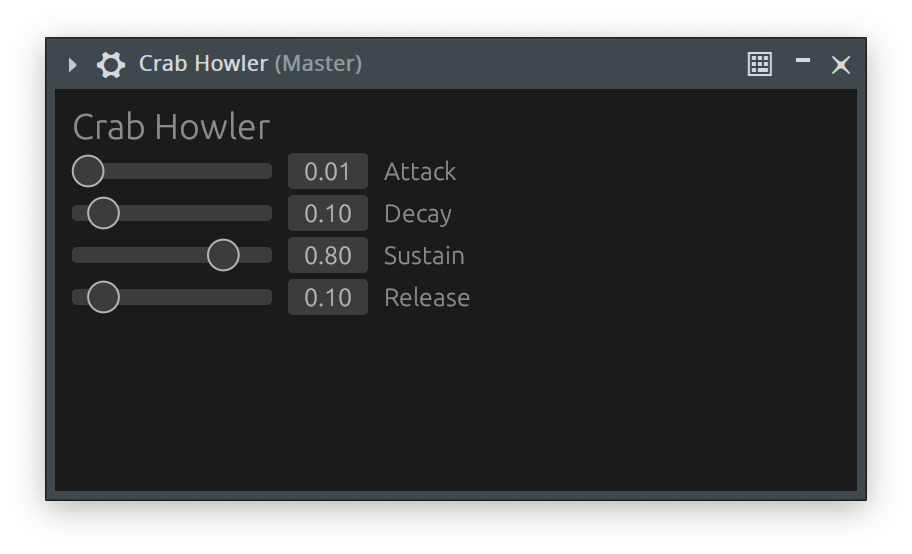

It's been quite some time now since I published
[part 2](/2024/07/writing-a-clap-synthesizer-in-rust-part-2/). There's many
reasons for this of course, but one of them was that when looking into how GUIs
work in CLAP plugins I kind of expected to be able to register a callback that
would get called each time a new frame was requested, but it apparently does not
work like that.

## Getting started

Like the last part we need to start with enabling more feature flags in
`clack-extensions` using cargo.

```sh
cargo add --features gui,raw-window-handle_05 clack-extensions
```

And as in all previous posts, we should register a new extension, this time
`PluginGui`.

```rs
fn declare_extensions(builder: &mut PluginExtensions<Self>, shared: Option<&Self::Shared<'_>>) {
    builder
        .register::<PluginAudioPorts>()
        .register::<PluginNotePorts>()
        .register::<PluginParams>()
        .register::<PluginState>()
        .register::<PluginGui>();
}
```

For the GUI we will now need to implement `PluginGuiImpl` for our
`CrabHowlerMainThread`. This is quite a big trait, so I think I will go through
it a few functions at a time so I can explain things step by step.

Let's start with `is_api_supported` and `get_preferred_api`, which should have
different behavior depending on what platform we're running on. The preferred
way is to create an embedded window, meaning that we (the plugin) are
responsible for creating the window and then embedding it into the hosts (the
DAW) window. This is however **not** supported on Wayland, so for now we will
just ignore that for simplicity, and focus our efforts on Win32, Cocoa and X11.

Conveniently `clack-extensions` already comes with a method that will return
Win32 on Windows, Cocoa on macOS and X11 on anything Unix, making the
implementation straightforward.

```rs
impl<'a> PluginGuiImpl for CrabHowlerMainThread<'a> {
    fn is_api_supported(&mut self, configuration: GuiConfiguration) -> bool {
        configuration.api_type
            == GuiApiType::default_for_current_platform().expect("Unsupported platform")
            && !configuration.is_floating
    }

    fn get_preferred_api(&mut self) -> Option<GuiConfiguration> {
        Some(GuiConfiguration {
            api_type: GuiApiType::default_for_current_platform().expect("Unsupported platform"),
            is_floating: false,
        })
    }
...
```

## Picking a GUI library

I spent some time looking around at different
[UI libraries](https://areweguiyet.com) to get a feel for what I should use, but
in the end I think [egui](https://www.egui.rs) will be the simplest one to set
up, and it should also give us very simple rendering and state handling since
it's immediate mode.

`egui` itself does not come with any window handling, and while I would normally
use `winit` for that, it apparently
[does not support](https://github.com/rust-windowing/winit/issues/1161) wrapping
an already existing window, which is exactly what we need to do when the DAW
gives us a window handle. Instead I opted for
[baseview](https://github.com/RustAudio/baseview) and
[egui-baseview](https://github.com/BillyDM/egui-baseview).

```sh
cargo add --git https://github.com/RustAudio/baseview.git --rev 9a0b42c09d712777b2edb4c5e0cb6baf21e988f0 baseview
cargo add --git https://github.com/BillyDM/egui-baseview.git
cargo add raw-window-handle@0.5.2
```

These are added as git dependencies because from what I can see they are not
published on crates.io.

## Setting up the UI

In order to keep our constantly growing `lib.rs` file in check, lets put the GUI
related code into a new `gui.rs` file.

The only thing we need to keep track of are the parent window handle that will
be given to us by the DAW and our own `baseview` handle.

```rs
pub struct CrabHowlerGui {
    pub parent: Option<RawWindowHandle>,
    handle: Option<WindowHandle>,
}

impl Default for CrabHowlerGui {
    fn default() -> Self {
        Self {
            parent: None,
            handle: None,
        }
    }
}
```

As for implementation, we will only need `open` and `close` for this minimal
example.

```rs
impl CrabHowlerGui {
    pub fn open(&mut self, state: &CrabHowlerShared) -> Result<(), PluginError> {
        if self.parent.is_none() {
            return Err(PluginError::Message("No parent window provided"));
        }

        let settings = WindowOpenOptions {
            title: "CrabHowler".to_string(),
            size: Size::new(400.0, 200.0),
            scale: WindowScalePolicy::SystemScaleFactor,
            gl_config: Some(Default::default()),
        };

        self.handle = Some(EguiWindow::open_parented(
            self,
            settings,
            GraphicsConfig::default(),
            state.envelope.clone(),
            |_egui_ctx: &Context, _queue: &mut Queue, _state: &mut Arc<RwLock<Envelope>>| {},
            |egui_ctx: &Context, _queue: &mut Queue, state: &mut Arc<RwLock<Envelope>>| {
                let mut envelope = state.write().unwrap();

                egui::CentralPanel::default().show(egui_ctx, |ui| {
                    ui.heading("Crab Howler");
                    ui.add(Slider::new(&mut envelope.attack, 0.0..=1.0).text("Attack"));
                    ui.add(Slider::new(&mut envelope.decay, 0.0..=1.0).text("Decay"));
                    ui.add(Slider::new(&mut envelope.sustain, 0.0..=1.0).text("Sustain"));
                    ui.add(Slider::new(&mut envelope.release, 0.0..=1.0).text("Release"));
                });
            },
        ));

        Ok(())
    }

    pub fn close(&mut self) {
        if let Some(handle) = self.handle.as_mut() {
            handle.close();
            self.handle = None;
        }
    }
}
```

Note that we're passing `CrabHowlerShared` to the `open` function, this will be
clearer in a bit, but it's essentially because `egui_baseview` require the state
to be `'static + Send`, which we fulfill by using an `Arc`.

We'll not be doing any fancy custom controls or special rendering, as this is
only intended as an example of how to get basic GUI functionality running, so we
just set up 4 sliders for the ADSR values.

`EguiWindow::open_parented` takes anything `HasRawWindowHandle` as it's parent
argument, so we can just implement that for our type so we can pass `self`
there.

```rs
unsafe impl HasRawWindowHandle for CrabHowlerGui {
    fn raw_window_handle(&self) -> RawWindowHandle {
        self.parent.unwrap()
    }
}
```

## Hooking it up with CLAP

Let's move back to `lib.rs` now and add this new type as a member to our main
thread struct.

```rs
pub struct CrabHowlerMainThread<'a> {
    shared: &'a CrabHowlerShared,
    gui: CrabHowlerGui,
}
```

This will require us to update `new_main_thread` as well, but since we
implemented `Default` for our new GUI type this is simple.

```rs
fn new_main_thread<'a>(
    host: HostMainThreadHandle<'a>,
    shared: &'a Self::Shared<'a>,
) -> Result<Self::MainThread<'a>, PluginError> {
    Ok(Self::MainThread {
        shared,
        gui: CrabHowlerGui::default(),
    })
}
```

We can then continue the implementation of `PluginGuiImpl`. Most of the
functions that the interface require of us can be left empty for simplicity,
with the important ones being `set_parent`, `show` and `hide`.

```rs
...
    fn create(
        &mut self,
        configuration: clack_extensions::gui::GuiConfiguration,
    ) -> Result<(), PluginError> {
        Ok(())
    }

    fn destroy(&mut self) {}

    fn set_scale(&mut self, scale: f64) -> Result<(), PluginError> {
        Ok(())
    }

    fn get_size(&mut self) -> Option<clack_extensions::gui::GuiSize> {
        Some(clack_extensions::gui::GuiSize {
            width: 400,
            height: 200,
        })
    }

    fn set_size(&mut self, size: clack_extensions::gui::GuiSize) -> Result<(), PluginError> {
        Ok(())
    }

    fn set_parent(&mut self, window: clack_extensions::gui::Window) -> Result<(), PluginError> {
        self.gui.parent = Some(window.raw_window_handle());
        Ok(())
    }

    fn set_transient(&mut self, window: clack_extensions::gui::Window) -> Result<(), PluginError> {
        Ok(())
    }

    fn show(&mut self) -> Result<(), PluginError> {
        self.gui.open(&self.shared)?;
        Ok(())
    }

    fn hide(&mut self) -> Result<(), PluginError> {
        self.gui.close();
        Ok(())
    }
}
```

We will also need to wrap our `envelope` in an `Arc` like I mentioned earler.

```rs
pub struct CrabHowlerShared {
    envelope: Arc<RwLock<Envelope>>,
}
```

## The result

We're finally ready to build it and test it out in a DAW.



It may not be fancy, but it's drawn entirely by the plug itself.

### Getting the code

As always the code is available by browsing the `part-3` tag over at
[github.com/Kwarf/crabhowler](https://github.com/Kwarf/crabhowler/tree/part-3).

## Conclusion

I don't think there will ever be a part 4 in this series. While it was a fun
exercise and a good look into how CLAP works, I think it would be much easier
and cleaner to use something _slightly_ higher level for most plugins, like
[nih-plug](https://github.com/robbert-vdh/nih-plug). I'm also constantly
fighting urges to refactor the code, and to fix things like the slightly wonky
ADSR handling causing clicks, but this feels hard to do in blog form and I
don't want the source tree to dramatically change from one post to another.

If I do end up continuing my exploration of plugins I will likely focus more on
the actual audio side of it, and less on frameworks.
